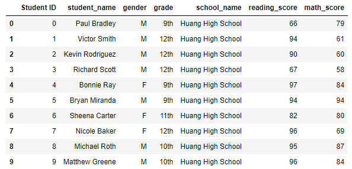
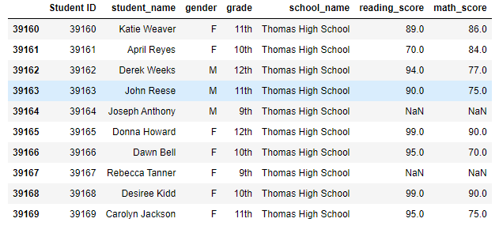
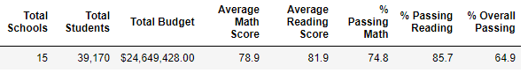

# School_District_Analysis

## Overview
The purpose of the analysis was to compile student data across the district as well as examine correlations between performance and some key factors such as budget and student count. 

## Results

### District Summary

Removing the scores of the ninth graders at THS had a marginal effect on the data. DataFrame before and after snapshots are included below.

- Original % of students passing reading: 85.8%
- Original % of students passing math: 75.0%

- New % of students passing reading: 85.7%
- New % of students passing math: 74.8%

The district summary is captured in the screenshot below:

### School Summary
Thomas High School 9th did not have any scores after the removal. This removal did not affect the other schools' scores because they were not contained within the other schools' score set.

## Summary
After reading and math scores were replaced:
1. The total number of data points used for the analysis decreased from 39170 to 38709; 461 data points were rejected
2. The average reading score decreased from 81.88 to 81.86
3. The average math score decreased from 78.99 to 78.93
4. the average number of students that passed overall (both reading and math) decreased from x to y
